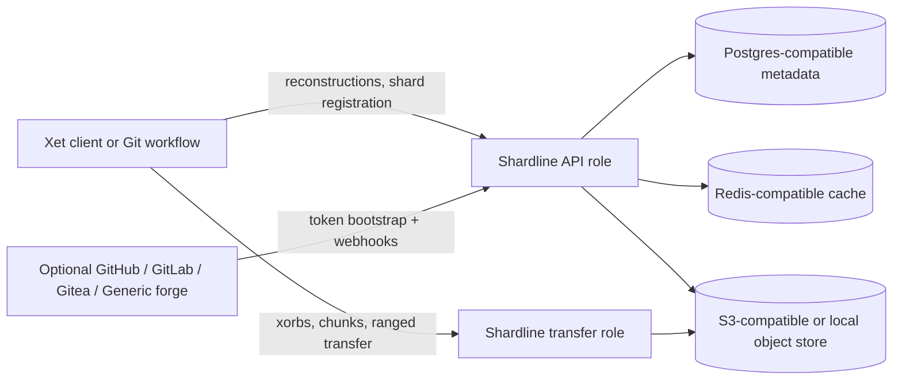
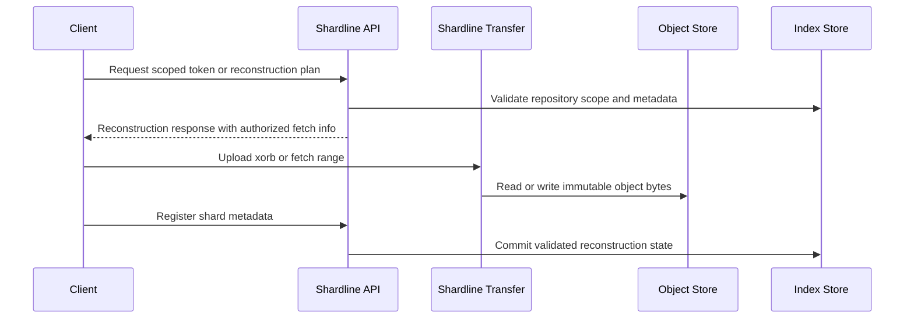
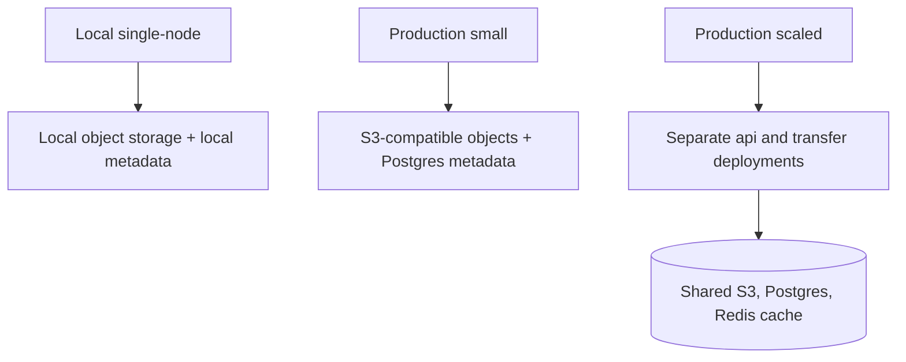

# Shardline

Shardline is an open, self-hostable content-addressed storage backend with
Xet-compatible protocol support.

It accepts immutable object uploads, verifies protocol objects, plans
reconstructions, serves range-aware downloads, and can run either as a direct,
providerless Xet-compatible backend or with GitHub, GitLab, Gitea, or generic Git forge
integration without baking provider-specific behavior into the CAS core.

The first production frontend Shardline supports is Xet.
Today, `shardline serve` exposes that Xet frontend by default, and there is not yet a
`--frontend` selector because no second runtime frontend has landed.
The core storage, indexing, and reconstruction boundaries stay separate from Xet-specific
protocol handling so additional CAS frontends can be added without rewriting the engine.

For small deployments, `shardline serve` runs the control plane and transfer plane in
one process. Larger deployments can split the same binary into `api` and `transfer`
roles. `--role` only changes deployment topology; it does not switch protocol frontends.

Shardline now compiles on non-Unix targets as well. Local filesystem hardening remains
strongest on Unix, and the current non-Unix claim is compile compatibility rather than
full runtime parity.

## Why Shardline

- self-hostable CAS backend with Xet-compatible protocol support
- production-oriented operator surface: health checks, migrations, fsck, repair, backup,
  storage migration, retention holds, and garbage collection
- storage and metadata adapters kept behind explicit boundaries
- provider integration kept outside the CAS core
- security posture centered on hostile-input handling, bounded work, and fail-closed
  local filesystem behavior

## Getting Started

Shardline is not a one-command quick-start project.

Even the local profile requires you to choose and validate storage, metadata, and
token-signing. Provider bootstrap and webhook configuration are optional and only apply
to provider-backed flows.
Read the deployment and operator docs first, then choose the deployment profile that
matches your environment.

Start here:

- [Deployment](docs/DEPLOYMENT.md)
- [Operations](docs/OPERATIONS.md)
- [CLI](docs/CLI.md)
- [Database Migrations](docs/DATABASE_MIGRATIONS.md)

For a direct, providerless Xet-compatible backend:

- deploy the local SQLite + filesystem profile or Postgres + S3 profile
- from a source checkout, run `shardline serve`; it bootstraps `.shardline/`
  automatically
- if you want bootstrap without starting the server, run `shardline providerless setup`
- mint repository-scoped bearer tokens with `shardline admin token`
- point clients directly at the Shardline base URL

For provider-aware setup, token issuance, and stock `git` + `git-lfs` + `git-xet`
workflows, continue with:

- [Provider Setup Guide](docs/PROVIDER_QUICKSTART.md)
- [Client Configuration](docs/CLIENT_CONFIGURATION.md)
- [Repository Bootstrap](docs/REPOSITORY_BOOTSTRAP.md)

## Architecture

## Deployment Profiles

- Local single-node: `docker compose -f docker-compose.yml up --build`
  By default, Compose keeps a development signing key in the container volume. If you
  want host-minted tokens, pass the same key with `SHARDLINE_TOKEN_SIGNING_KEY=...`
  and mint with `shardline admin token --key-env SHARDLINE_TOKEN_SIGNING_KEY`.
- Production small: one `shardline serve` process with durable object and metadata
  stores
- Production scaled: split `shardline serve --role api` and
  `shardline serve --role transfer`

All three profiles can run providerless.
Provider integration is optional and only needed when a forge or bridge service must
mint scoped CAS tokens on behalf of users.
The exact validated local providerless steps are in
[Providerless Direct Xet Backend](docs/DEPLOYMENT.md#providerless-direct-xet-backend).

Start with [Deployment](docs/DEPLOYMENT.md), then use
[Shardline Kubernetes](docs/k8s/README.md) for the production-scaled manifest set.

## Production Readiness

Shardline is released as `1.0.0` with an explicitly scoped compatibility contract.

What is already in place:

- documented local, small-production, and scaled-production deployment profiles
- production Kubernetes manifests for split API and transfer roles
- permanent regression coverage for security-sensitive storage, protocol, and operator
  boundaries
- fuzz targets for protocol parsing, lifecycle repair, storage boundaries, CLI parsing,
  and local filesystem race conditions
- end-to-end coverage for native Xet flows and provider-mediated workflows
- operator commands for config checks, migrations, fsck, repair, GC, rebuild, backup,
  and storage migration

What is intentionally not claimed yet:

- full drop-in Xet backend coverage across every possible Git workflow and deployment
  matrix
- non-Unix parity; shardline crates now compile on non-Unix targets, but local
  filesystem hardening is still strongest on Unix and only has compile coverage on
  Windows so far
- crates.io availability before the first ordered release publishes the internal crate
  graph

Read these before a production rollout:

- [Deployment](docs/DEPLOYMENT.md)
- [Operations](docs/OPERATIONS.md)
- [Compatibility Status](docs/COMPATIBILITY_STATUS.md)
- [Security and Invariants](docs/SECURITY_AND_INVARIANTS.md)

## Crate Map

| Crate | Purpose |
| --- | --- |
| `protocol` | Xet protocol types, hash parsing, byte-range handling, and token types |
| `cache` | Reconstruction-cache traits and adapters |
| `storage` | Immutable object-storage contracts and adapters |
| `index` | Reconstruction and deduplication metadata contracts and adapters |
| `cas` | Protocol-neutral CAS coordinator domain and composition |
| `vcs` | Provider adapters and authorization boundaries |
| `server` | HTTP routes, runtime wiring, migrations, fsck, GC, repair, and rollout logic |
| `cli` | `shardline` operator binary |

## Documentation

- [Docs Index](docs/README.md)
- [Contributing](CONTRIBUTING.md)
- [CLI](docs/CLI.md)
- [Protocol Conformance](docs/PROTOCOL_CONFORMANCE.md)
- [Compatibility Status](docs/COMPATIBILITY_STATUS.md)
- [Deployment](docs/DEPLOYMENT.md)
- [Operations](docs/OPERATIONS.md)
- [Provider Setup Guide](docs/PROVIDER_QUICKSTART.md)
- [Performance](docs/PERFORMANCE.md)

## License

Shardline is dual licensed under either of these, at your option:

- [MIT License](LICENSE-MIT)
- [Apache License 2.0](LICENSE-APACHE)
