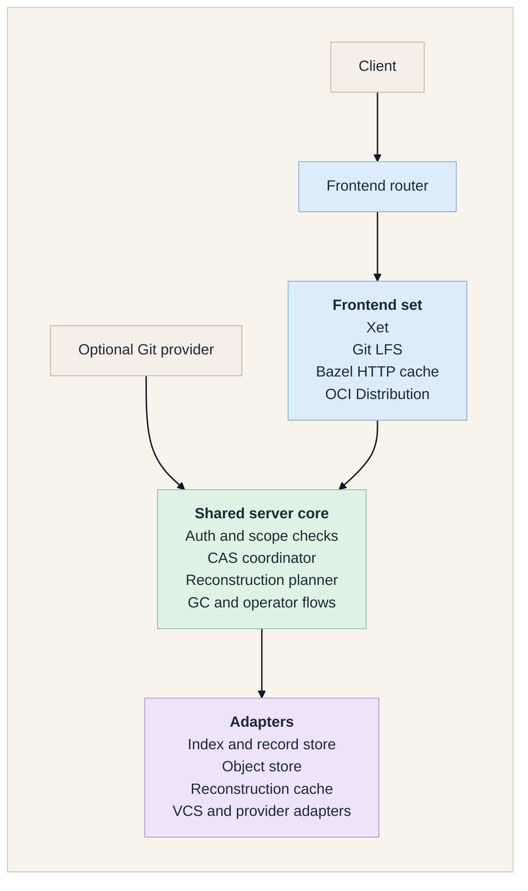
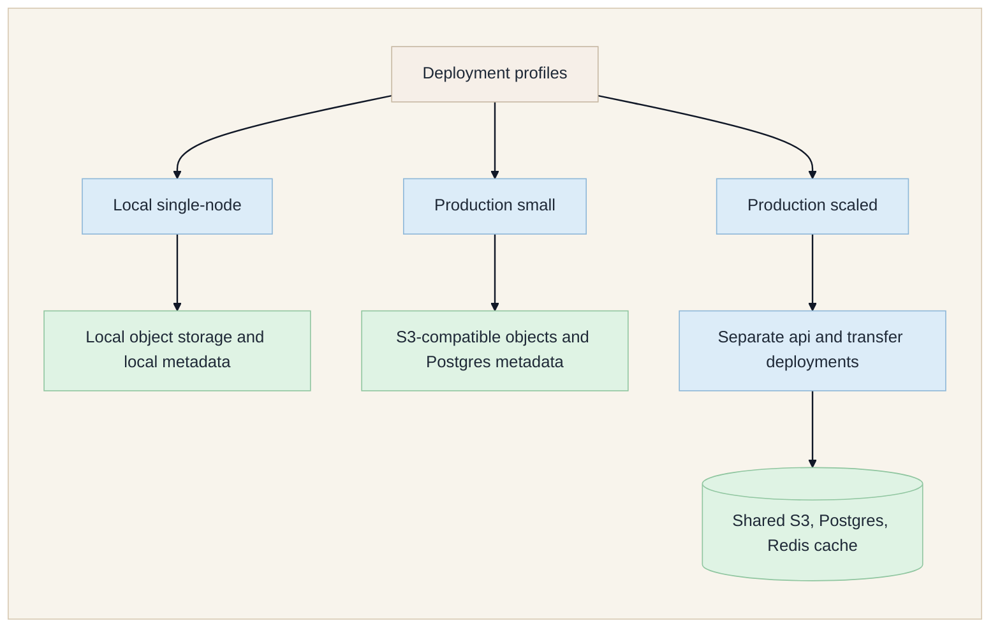

# Shardline

Shardline is an open, self-hostable content-addressed storage backend with
pluggable protocol frontends.

It accepts immutable object uploads, verifies protocol objects, plans
reconstructions, and serves range-aware downloads. You can run it directly as a
providerless CAS backend or pair it with GitHub, GitLab, Gitea, or a generic Git
provider without baking provider-specific behavior into the CAS core.

Validated frontends in this repository today are Xet, Git LFS, Bazel HTTP remote
cache, and OCI Distribution.
`shardline serve` now accepts an explicit frontend set through `--frontend` or
`SHARDLINE_SERVER_FRONTENDS`, with `xet` enabled by default.
The core storage, indexing, and reconstruction boundaries stay separate from
frontend-specific protocol handling.

For small deployments, `shardline serve` runs the control plane and transfer plane in
one process. Larger deployments can split the same binary into `api` and `transfer`
roles. `--role` only changes deployment topology; the enabled frontend set controls the
protocol surface.

## Why Shardline

- self-hostable CAS backend with explicit protocol frontends
- production-oriented operator surface: health checks, migrations, fsck, repair, backup,
  storage migration, retention holds, and garbage collection
- storage and metadata adapters kept behind explicit boundaries
- provider integration kept outside the CAS core
- security posture centered on hostile-input handling, bounded work, and fail-closed
  local filesystem behavior

## Getting Started

Shardline is not a one-command quick-start project. Even the local profile still needs
storage, metadata, and token-signing configured correctly.

Start here:

- [Deployment](docs/DEPLOYMENT.md)
- [Operations](docs/OPERATIONS.md)
- [CLI](docs/CLI.md)
- [Database Migrations](docs/DATABASE_MIGRATIONS.md)

For the current providerless Xet-compatible backend:

- deploy the local SQLite + filesystem profile or Postgres + S3 profile
- from a source checkout, run `shardline serve`; it bootstraps `.shardline/`
  automatically
- if you want bootstrap without starting the server, run `shardline providerless setup`
- mint repository-scoped bearer tokens with `shardline admin token`
- point clients directly at the Shardline base URL

For provider-aware setup, token issuance, and stock `git` + `git-lfs` + `git-xet`
workflows, continue with:

- [Provider Setup Guide](docs/PROVIDER_QUICKSTART.md)
- [Client Configuration](docs/CLIENT_CONFIGURATION.md)
- [Repository Bootstrap](docs/REPOSITORY_BOOTSTRAP.md)

## Architecture

- The router enables one or more frontends.
- Optional Git providers interact through the server/core path for token issuance and webhooks.
- The shared core stays protocol-neutral where possible.
- Storage, metadata, cache, and provider logic stay behind adapter boundaries.

## Deployment Profiles

- Local single-node: `docker compose -f docker-compose.yml up --build`
  By default, Compose keeps a development signing key in the container volume. If you
  want host-minted tokens, pass the same key with `SHARDLINE_TOKEN_SIGNING_KEY=...`
  and mint with `shardline admin token --key-env SHARDLINE_TOKEN_SIGNING_KEY`.
- Production small: one `shardline serve` process with durable object and metadata
  stores
- Production scaled: split `shardline serve --role api` and
  `shardline serve --role transfer`

All three profiles can run providerless.
Provider integration is optional and only needed when a forge or bridge service must
mint scoped CAS tokens on behalf of users.
The exact validated local providerless Xet steps are in
[Providerless Direct Xet Backend](docs/DEPLOYMENT.md#providerless-direct-xet-backend).

Start with [Deployment](docs/DEPLOYMENT.md), then use
[Shardline Kubernetes](docs/k8s/README.md) for the production-scaled manifest set.

## Production Readiness

Shardline is released as `1.0.0` for the protocol and operator surface documented in
this repo. Before a production rollout, read:

- [Deployment](docs/DEPLOYMENT.md)
- [Operations](docs/OPERATIONS.md)
- [Compatibility Status](docs/COMPATIBILITY_STATUS.md)
- [Security and Invariants](docs/SECURITY_AND_INVARIANTS.md)

## Crate Map

| Crate | Purpose |
| --- | --- |
| `protocol` | Shared protocol-facing types, hash and byte-range parsing, scoped token types, and small security/time/text helpers |
| `cache` | Reconstruction-cache traits and adapters |
| `storage` | Immutable object-storage contracts and adapters |
| `index` | Reconstruction and deduplication metadata contracts and adapters |
| `cas` | Protocol-neutral CAS coordinator domain and composition |
| `vcs` | Provider adapters and authorization boundaries |
| `server` | HTTP routes, runtime wiring, migrations, fsck, GC, repair, and rollout logic |
| `cli` | `shardline` operator binary |

## Documentation

- [Docs Index](docs/README.md)
- [Deployment](docs/DEPLOYMENT.md)
- [Operations](docs/OPERATIONS.md)
- [Provider Setup Guide](docs/PROVIDER_QUICKSTART.md)
- [Client Configuration](docs/CLIENT_CONFIGURATION.md)
- [Contributing](CONTRIBUTING.md)
- [CLI](docs/CLI.md)
- [Protocol Frontends](docs/PROTOCOLS.md)
- [Protocol Conformance](docs/PROTOCOL_CONFORMANCE.md)
- [Compatibility Status](docs/COMPATIBILITY_STATUS.md)
- [Performance](docs/PERFORMANCE.md)

## License

Shardline is dual licensed under either of these, at your option:

- [MIT License](LICENSE-MIT)
- [Apache License 2.0](LICENSE-APACHE)
