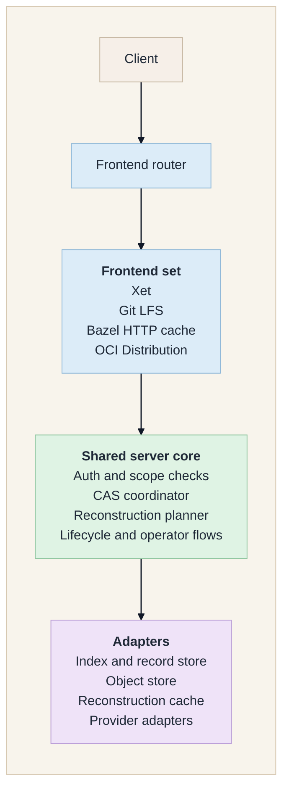
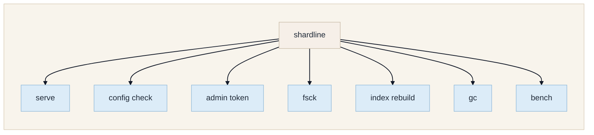
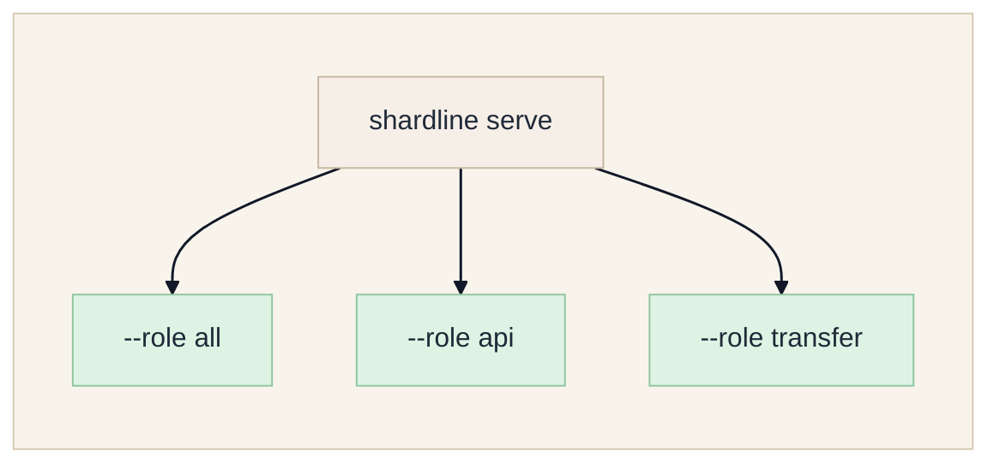
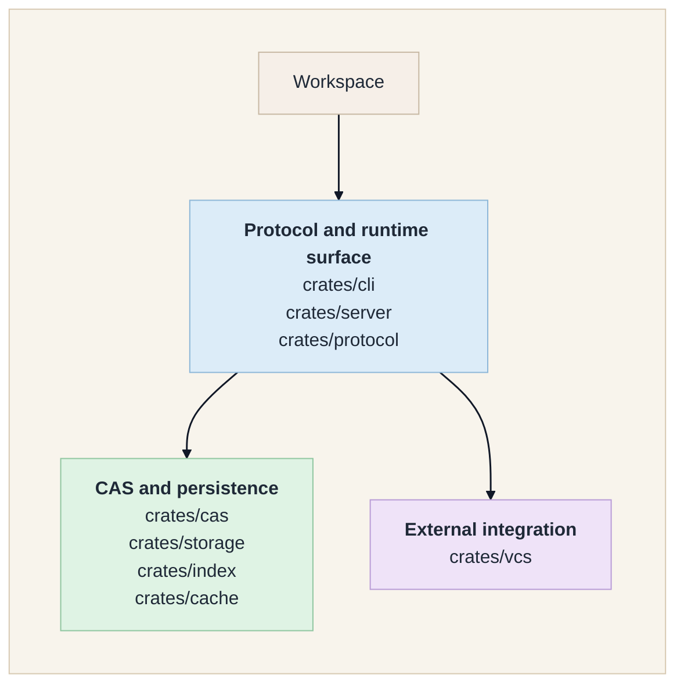

# Architecture

Shardline is an open, self-hostable content-addressed storage backend with
pluggable protocol frontends.
It uses a protocol-neutral CAS coordinator with explicit frontend adapters.
The runtime hosts an explicit frontend set.
Validated frontends in this repository today are Xet, Git LFS, Bazel HTTP remote
cache, and OCI Distribution.
They share the same storage, metadata, authorization, lifecycle, and operator
surface while keeping protocol-specific request shaping and object handling in
dedicated adapters.

## Goals

- Speak one or more practical CAS-facing protocols behind a shared backend.
- Speak the public Xet CAS API closely enough for existing Xet-compatible clients.
- Reduce repeated upload and storage costs through chunk-level deduplication.
- Support local and cloud object storage through explicit adapter contracts.
- Run as a single Docker container for small deployments.
- Scale to separate API, transfer, metadata, and object-storage layers for larger
  deployments.
- Keep correctness and integrity checks in the coordinator, not only in clients.

## Non-Goals

- Replacing Git itself.
- Requiring users to abandon existing version-control platforms.
- Building a full hosted code forge.
- Trusting client-provided hashes without verification.
- Making global deduplication visible across tenants by default.

## Component Model

Read it as:

- the router selects among the enabled frontends for each request
- the shared core handles authorization, coordination, reconstruction, and operator
  workflows
- adapters provide the durable storage, metadata, cache, and provider boundaries

## Persistence Model

Shardline needs three persistence categories:

- **Object storage**: immutable object bytes and retained container bytes.
- **Index storage**: metadata needed for reconstruction, deduplication, authorization,
  garbage collection, and integrity checks.
- **Record storage**: durable file-version records and derived latest-file records for
  local deployments and repair tooling.

The index crate exposes memory, local SQLite, and Postgres-compatible adapters for these
metadata contracts. Memory adapters are non-durable and intended for contract tests and
embedded development.
Local SQLite adapters support self-hosted single-node operation and operator repair
tooling while keeping payload bytes on the filesystem.
Postgres-compatible adapters provide the durable production metadata path.

The stores must be updated with explicit ordering:

1. Protocol object bytes are validated.
2. Immutable object bytes are written idempotently.
3. Container metadata is validated against existing stored objects.
4. Index rows are committed atomically.
5. File reconstructions become visible after the index commit succeeds.

Shardline can also use a non-authoritative reconstruction cache.
Cache adapters accelerate repeated reconstruction planning but must never become the
source of truth. If a cache entry is missing, stale, or unavailable, the server falls
back to durable metadata and repairs the cache lazily.

## Public API Surface

The current production server exposes multiple protocol route families:

- Xet:
  `GET /v1/reconstructions/{file_id}`,
  `GET /v1/chunks/default/{hash}`,
  `POST /v1/xorbs/default/{hash}`,
  `POST /v1/shards`
- Git LFS:
  `POST /v1/lfs/objects/batch`,
  `GET|HEAD|PUT /v1/lfs/objects/{oid}`
- Bazel HTTP remote cache:
  `GET|PUT /v1/bazel/cache/ac/{hash}`,
  `GET|PUT /v1/bazel/cache/cas/{hash}`
- OCI Distribution:
  `GET /v2/`,
  blob upload and download routes,
  manifest `PUT|GET|HEAD|DELETE`,
  `GET /v2/{repository}/tags/list`,
  `GET /v2/token`

When provider-backed token issuance is enabled, the server also exposes:

- `POST /v1/providers/{provider}/tokens`
- `POST /v1/providers/{provider}/webhooks`

For storage adapters that cannot issue native presigned URLs, the Xet frontend also
exposes a range-enforced transfer endpoint:

- `GET /transfer/xorb/{prefix}/{hash}`

The Xet-specific route constants, hash/path validation, transfer URL construction,
reconstruction shaping, and protocol-object ingest flow are intentionally isolated
inside the server's `xet_adapter` layer rather than spread through generic backend and
routing code.

Other frontends follow the same pattern:

- protocol-specific route registration at the HTTP edge
- protocol-specific object-key and request-shape logic inside a dedicated adapter
- shared authorization, object storage, metadata, cache, fsck, repair, and GC
  services in the core

The transfer endpoint is an implementation detail.
Reconstruction responses can point to native presigned object-store URLs when an adapter
supports them.

## CLI Shape

Shardline ships as a single CLI with subcommands:

The server command is the production entrypoint.
The remaining commands support operability and correctness checks.

For scaled deployments, the same command also supports explicit runtime roles:

`api` serves control-plane and metadata-oriented endpoints such as reconstruction
lookup, provider-backed token issuance, webhook handling, LFS batch negotiation,
and OCI tag, manifest, and token-service routes.
`transfer` serves the large request and response paths such as chunk download,
protocol object upload, blob transfer, cache object transfer, and Xet xorb range
transfer.
`all` keeps the single-node behavior and serves both route sets from one process.

## Source Layout

Crate responsibilities:

- `protocol`: shared protocol types, generic hashes, ranges, tokens, and small
  security/time/text helpers
- `server`: HTTP runtime, frontend hosting, migrations, repair, and GC
- `cli`: operator entrypoint and command wiring
- `cas`: protocol-neutral coordination and planning
- `storage`: immutable object-storage contracts and adapters
- `index`: metadata and record-storage contracts and adapters
- `cache`: reconstruction-cache contracts and adapters
- `vcs`: provider integration boundaries

The crate boundaries keep protocol handling, server operation, storage, indexing, and
provider integration independent.

`lib.rs` and `mod.rs` files are reserved for module declarations and public re-exports
only. Concrete types, functions, trait implementations, tests, and internal helpers live
in named module files such as `hash.rs`, `store.rs`, or `coordinator.rs`. New modules
should use named files directly; do not introduce `mod.rs` files.

## Concurrency Model

The server is async-first and streams large request and response bodies.
It must not buffer full untrusted uploads or full reconstructed downloads in memory
unless the body is already within an explicit small bound.
The coordinator consumes bounded request frames, validates protocol objects under the
configured request-size limits, then commits bytes through the selected object-storage
adapter.

Expected concurrency behavior:

- frontend-specific upload bodies are capped before validation and commit
- Xet shard metadata sections are counted and bounded before per-section records are
  materialized
- Git LFS and Bazel HTTP object paths validate digest shape before storage access
- OCI upload sessions, tag listing, token issuance, and manifest writes are bounded
  by explicit limits before they reach durable state
- object writes are idempotent by content hash
- protocol metadata registration uses transactional metadata updates where the
  frontend requires it
- reconstruction planning is read-heavy and avoids coarse locks
- transfer responses and registry/blob reads stream bytes and support range reads
  and backpressure
- local transfer reads use bounded async file buffers after metadata and authorization
  validation

## VCS Integration Boundary

Version-control platforms are permission and repository providers, not the CAS itself.

The integration layer supports:

- issuing read/write CAS tokens after provider permission checks
- mapping repository and revision identity into token scopes
- receiving webhooks for cleanup and lifecycle reconciliation

Provider webhooks are normalized before they reach lifecycle logic.
The current server accepts repository lifecycle events from supported providers and
turns repository deletion into time-bounded retention holds for the affected chunk and
serialized-xorb objects while removing the deleted repository's metadata roots.
That keeps provider-driven cleanup outside the data path while giving garbage collection
a durable grace window.
Repository rename is also applied durably.
`access_changed` and `revision_pushed` are persisted as provider-derived repository
lifecycle state, including the latest observed access-change timestamp and pushed
revision for each provider repository.
That durable state gives repair, auditing, token issuance, and repository-drift checks a
stable source of truth without coupling the CAS core to provider-specific webhook
payloads. Successful provider token issuance reconciles pending lifecycle signals by
recording authorization recheck, cache-invalidation, and drift-check timestamps for the
repository.

The core CAS must remain usable without any platform-specific integration.

Provider adapters are first-class extension points, just like storage adapters.
GitHub, GitLab, Gitea, and generic forges should plug into the same normalized provider
contract so repository hosting logic does not leak into chunking, reconstruction, or
storage code.

The issuance path is explicit:

- provider adapter evaluates repository access for a concrete subject
- only an allowed authorization result becomes a signed CAS token
- the signed token is then used on the normal CAS API

This keeps provider logic out of the CAS core while preserving a single authorization
model on the data plane.
