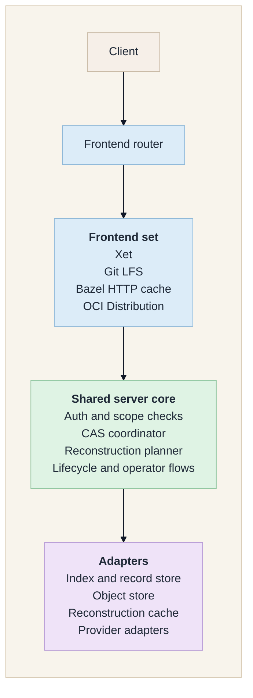
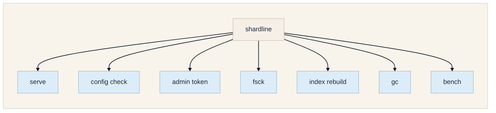
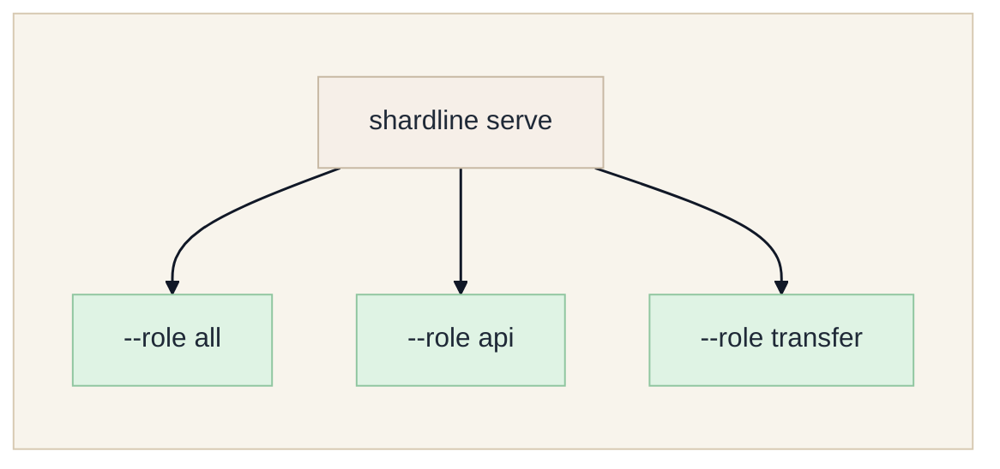
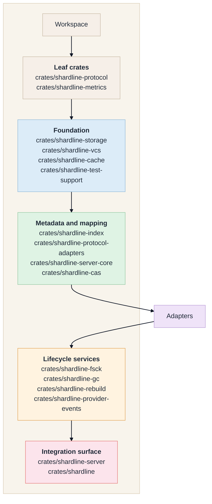

# Architecture

Shardline is an open, self-hostable content-addressed storage backend with pluggable
protocol frontends. It uses a protocol-neutral CAS coordinator with explicit frontend
adapters. The runtime hosts an explicit frontend set.
Validated frontends in this repository today are Xet, Git LFS, Bazel HTTP remote cache,
OCI Distribution, and HuggingFace Hub API (REST + Git Smart HTTP).
They share the same storage, metadata, authorization, lifecycle, and operator surface
while keeping protocol-specific request shaping and object handling in dedicated
adapters.

## Goals

- Speak one or more practical CAS-facing protocols behind a shared backend.
- Speak the public Xet CAS API closely enough for existing Xet-compatible clients.
- Reduce repeated upload and storage costs through chunk-level deduplication.
- Support local and cloud object storage through explicit adapter contracts.
- Run as a single Docker container for small deployments.
- Scale to separate API, transfer, metadata, and object-storage layers for larger
  deployments.
- Keep correctness and integrity checks in the coordinator, not only in clients.

## Non-Goals

- Replacing Git itself.
- Requiring users to abandon existing version-control platforms.
- Building a full hosted code forge.
- Trusting client-provided hashes without verification.
- Making global deduplication visible across tenants by default.

## Component Model

```mermaid
flowchart TD
  subgraph Canvas[ ]
    direction TD
    Client[Client]
    Router[Frontend router]
    Frontends["<b>Frontend set</b><br/>Xet<br/>Git LFS<br/>Bazel HTTP cache<br/>OCI Distribution"]
    Core["<b>Shared server core</b><br/>Auth and scope checks<br/>CAS coordinator<br/>Reconstruction planner<br/>Lifecycle and operator flows"]
    Adapters["<b>Adapters</b><br/>Index and record store<br/>Object store<br/>Reconstruction cache<br/>Provider adapters"]
  end

  Client --> Router
  Router --> Frontends
  Frontends --> Core
  Core --> Adapters

  classDef neutral fill:#f6efe8,stroke:#c7b8a3,color:#1f2937;
  classDef frontend fill:#dcecf8,stroke:#8db7d8,color:#1f2937;
  classDef core fill:#dff3e4,stroke:#90c6a0,color:#1f2937;
  classDef adapter fill:#efe3f8,stroke:#b89bd6,color:#1f2937;
  style Canvas fill:#f8f4ec,stroke:#d7c9b2,color:#1f2937;
  class Client neutral;
  class Router,Frontends frontend;
  class Core core;
  class Adapters adapter;
  linkStyle default stroke:#111827,stroke-width:1.5px;
```

Read it as:

- the router selects among the enabled frontends for each request
- the shared core handles authorization, coordination, reconstruction, and operator
  workflows
- adapters provide the durable storage, metadata, cache, and provider boundaries

## Persistence Model

Shardline needs three persistence categories:

- **Object storage**: immutable object bytes and retained container bytes.
- **Index storage**: metadata needed for reconstruction, deduplication, authorization,
  garbage collection, and integrity checks.
- **Record storage**: durable file-version records and derived latest-file records for
  local deployments and repair tooling.

The index crate exposes memory, local SQLite, and Postgres-compatible adapters for these
metadata contracts. Memory adapters are non-durable and intended for contract tests and
embedded development.
Local SQLite adapters support self-hosted single-node operation and operator repair
tooling while keeping payload bytes on the filesystem.
Postgres-compatible adapters provide the durable production metadata path.

The stores must be updated with explicit ordering:

1. Protocol object bytes are validated.
2. Immutable object bytes are written idempotently.
3. Container metadata is validated against existing stored objects.
4. Index rows are committed atomically.
5. File reconstructions become visible after the index commit succeeds.

Shardline can also use a non-authoritative reconstruction cache.
Cache adapters accelerate repeated reconstruction planning but must never become the
source of truth. If a cache entry is missing, stale, or unavailable, the server falls
back to durable metadata and repairs the cache lazily.

## Public API Surface

The current production server exposes multiple protocol route families:

- Xet: `GET /v1/reconstructions/{file_id}`, `GET /v1/chunks/default/{hash}`,
  `POST /v1/xorbs/default/{hash}`, `POST /v1/shards`
- Git LFS: `POST /v1/lfs/objects/batch`, `GET|HEAD|PUT /v1/lfs/objects/{oid}`
- Bazel HTTP remote cache: `GET|PUT /v1/bazel/cache/ac/{hash}`,
  `GET|PUT /v1/bazel/cache/cas/{hash}`
- OCI Distribution: `GET /v2/`, blob upload and download routes, manifest
  `PUT|GET|HEAD|DELETE`, `GET /v2/{repository}/tags/list`, `GET /v2/token`
- HuggingFace Hub REST: `GET/POST /api/{type}/{ns}/{repo}`, revisions, file entries,
  LFS objects, commit protocol (NDJSON)
- HuggingFace Hub Git Smart HTTP: `GET /{type}/{ns}/{repo}/info/refs`,
  `GET /{type}/{ns}/{repo}/HEAD`, `POST /{type}/{ns}/{repo}/git-upload-pack`,
  `POST /{type}/{ns}/{repo}/git-receive-pack`

When provider-backed token issuance is enabled, the server also exposes:

- `POST /v1/providers/{provider}/tokens`
- `POST /v1/providers/{provider}/webhooks`

For storage adapters that cannot issue native presigned URLs, the Xet frontend also
exposes a range-enforced transfer endpoint:

- `GET /transfer/xorb/{prefix}/{hash}`

The Xet-specific route constants, hash/path validation, transfer URL construction,
reconstruction shaping, and protocol-object ingest flow are intentionally isolated
inside the server's `xet_adapter` layer rather than spread through generic backend and
routing code.

Other frontends follow the same pattern:

- protocol-specific route registration at the HTTP edge
- protocol-specific object-key and request-shape logic inside a dedicated adapter
- shared authorization, object storage, metadata, cache, fsck, repair, and GC services
  in the core

The transfer endpoint is an implementation detail.
Reconstruction responses can point to native presigned object-store URLs when an adapter
supports them.

## CLI Shape

Shardline ships as a single CLI with subcommands:

```mermaid
flowchart TD
  subgraph Canvas[ ]
    direction TD
    Root[shardline]
    Root --> Serve[serve]
    Root --> Check[config check]
    Root --> Admin[admin token]
    Root --> Fsck[fsck]
    Root --> Rebuild[index rebuild]
    Root --> Gc[gc]
    Root --> Bench[bench]
  end

  style Canvas fill:#f8f4ec,stroke:#d7c9b2,color:#1f2937;
  classDef root fill:#f6efe8,stroke:#c7b8a3,color:#1f2937;
  classDef command fill:#dcecf8,stroke:#8db7d8,color:#1f2937;
  class Root root;
  class Serve,Check,Admin,Fsck,Rebuild,Gc,Bench command;
  linkStyle default stroke:#111827,stroke-width:1.5px;
```

The server command is the production entrypoint.
The remaining commands support operability and correctness checks.

For scaled deployments, the same command also supports explicit runtime roles:

```mermaid
flowchart TD
  subgraph Canvas[ ]
    direction TD
    Serve[shardline serve]
    Serve --> All[--role all]
    Serve --> Api[--role api]
    Serve --> Transfer[--role transfer]
  end

  style Canvas fill:#f8f4ec,stroke:#d7c9b2,color:#1f2937;
  classDef root fill:#f6efe8,stroke:#c7b8a3,color:#1f2937;
  classDef role fill:#dff3e4,stroke:#90c6a0,color:#1f2937;
  class Serve root;
  class All,Api,Transfer role;
  linkStyle default stroke:#111827,stroke-width:1.5px;
```

`api` serves control-plane and metadata-oriented endpoints such as reconstruction
lookup, provider-backed token issuance, webhook handling, LFS batch negotiation, and OCI
tag, manifest, and token-service routes.
`transfer` serves the large request and response paths such as chunk download, protocol
object upload, blob transfer, cache object transfer, and Xet xorb range transfer.
`all` keeps the single-node behavior and serves both route sets from one process.

## Source Layout

The workspace contains 22 product crates organized in a layered dependency graph.

```mermaid
flowchart TD
  subgraph Canvas[ ]
    direction TD
    Workspace[Workspace]
    Leaf["<b>Leaf crates</b><br/>crates/shardline-protocol<br/>crates/shardline-metrics"]
    Foundation["<b>Foundation</b><br/>crates/shardline-storage<br/>crates/shardline-vcs<br/>crates/shardline-cache<br/>crates/shardline-test-support"]
    Middle["<b>Metadata and mapping</b><br/>crates/shardline-index<br/>crates/shardline-protocol-adapters<br/>crates/shardline-server-core<br/>crates/shardline-cas"]
    Lifecycle["<b>Lifecycle services</b><br/>crates/shardline-fsck<br/>crates/shardline-gc<br/>crates/shardline-rebuild<br/>crates/shardline-provider-events"]
    Integration["<b>Integration surface</b><br/>crates/shardline-server<br/>crates/shardline"]
  end

  Workspace --> Leaf
  Leaf --> Foundation
  Foundation --> Middle
  Middle --> Adapters
  Adapters --> Lifecycle
  Lifecycle --> Integration

  classDef root fill:#f6efe8,stroke:#c7b8a3,color:#1f2937;
  classDef leaf fill:#f6efe8,stroke:#c7b8a3,color:#1f2937;
  classDef foundation fill:#dcecf8,stroke:#8db7d8,color:#1f2937;
  classDef middle fill:#dff3e4,stroke:#90c6a0,color:#1f2937;
  classDef adapter fill:#efe3f8,stroke:#b89bd6,color:#1f2937;
  classDef lifecycle fill:#fff3e0,stroke:#e0a050,color:#1f2937;
  classDef integration fill:#fce4ec,stroke:#e57373,color:#1f2937;
  style Canvas fill:#f8f4ec,stroke:#d7c9b2,color:#1f2937;
  class Workspace root;
  class Leaf leaf;
  class Foundation foundation;
  class Middle middle;
  class Adapters adapter;
  class Lifecycle lifecycle;
  class Integration integration;
  linkStyle default stroke:#111827,stroke-width:1.5px;
```

### Layer 0 — Leaf crates (no workspace deps)

- `protocol`: wire-level types — `ShardlineHash`, `ByteRange`, `TokenSigner`,
  `RepositoryScope`, `SecretBytes`
- `metrics`: shared Prometheus metrics registry (`CasMetrics`) with global singleton

### Layer 1 — Foundation

- `storage`: content-addressed `ObjectStore` trait + `LocalObjectStore` and `S3ObjectStore`
- `vcs`: provider adapters (`ProviderAdapter` trait) for GitHub, GitLab, Gitea, Codeberg
- `cache`: reconstruction-cache trait + memory, Redis, and disabled adapters
- `test_support`: shared test helpers (`DockerLocalStack`)

### Layer 2 — Metadata and mapping

- `index`: metadata index and record-storage contracts + SQLite, Postgres, and memory
  adapters; Hub API tables (`HubStore` trait)
- `protocol_adapters`: LFS and Bazel object-key mapping functions
- `server_core`: shared server types — `AuthProvider` trait, `ServerObjectStore`,
  `ShardMetadataLimits`
- `cas`: CAS coordinator composition tying index + object store together

### Layer 3 — Protocol adapters

- `xet_adapter`: xorb/shard parsing, reconstruction response building, upload storage
- `hub_api`: HuggingFace Hub API compatibility — 15 REST routes + Git Smart HTTP protocol
- `oci_adapter`: OCI Distribution protocol — upload sessions, manifest/blob keys

### Layer 4 — Lifecycle services

- `fsck`: storage integrity checking (lifecycle, records, shards, orphans)
- `gc`: garbage collection with quarantine, retention, and sweep
- `rebuild`: metadata index rebuild from stored objects
- `provider_events`: webhook event processing and metadata mutations

### Layer 5 — Integration surface

- `server`: HTTP server, frontend routing, migrations, all protocol frontends
- `cli`: operator binary (`shardline serve`, `fsck`, `gc`, `rebuild`, `bench`)

### Layer 6 — Test infrastructure

- `fuzz`: 31 fuzz targets for protocol parsers, storage boundaries, mutable Hub refs, and frontends

Crate boundaries keep protocol handling, server operation, storage, indexing, and
provider integration independent.

`lib.rs` and `mod.rs` files are reserved for module declarations and public re-exports
only. Concrete types, functions, trait implementations, tests, and internal helpers live
in named module files such as `hash.rs`, `store.rs`, or `coordinator.rs`. New modules
should use named files directly; do not introduce `mod.rs` files.

## Concurrency Model

The server is async-first and streams large request and response bodies.
It must not buffer full untrusted uploads or full reconstructed downloads in memory
unless the body is already within an explicit small bound.
The coordinator consumes bounded request frames, validates protocol objects under the
configured request-size limits, then commits bytes through the selected object-storage
adapter.

Expected concurrency behavior:

- frontend-specific upload bodies are capped before validation and commit
- Xet shard metadata sections are counted and bounded before per-section records are
  materialized
- Git LFS and Bazel HTTP object paths validate digest shape before storage access
- OCI upload sessions, tag listing, token issuance, and manifest writes are bounded by
  explicit limits before they reach durable state
- object writes are idempotent by content hash
- protocol metadata registration uses transactional metadata updates where the frontend
  requires it
- reconstruction planning is read-heavy and avoids coarse locks
- transfer responses and registry/blob reads stream bytes and support range reads and
  backpressure
- local transfer reads use bounded async file buffers after metadata and authorization
  validation

## VCS Integration Boundary

Version-control platforms are permission and repository providers, not the CAS itself.

The integration layer supports:

- issuing read/write CAS tokens after provider permission checks
- mapping repository and revision identity into token scopes
- receiving webhooks for cleanup and lifecycle reconciliation

Provider webhooks are normalized before they reach lifecycle logic.
The current server accepts repository lifecycle events from supported providers and
turns repository deletion into time-bounded retention holds for the affected chunk and
serialized-xorb objects while removing the deleted repository's metadata roots.
That keeps provider-driven cleanup outside the data path while giving garbage collection
a durable grace window.
Repository rename is also applied durably.
`access_changed` and `revision_pushed` are persisted as provider-derived repository
lifecycle state, including the latest observed access-change timestamp and pushed
revision for each provider repository.
That durable state gives repair, auditing, token issuance, and repository-drift checks a
stable source of truth without coupling the CAS core to provider-specific webhook
payloads. Successful provider token issuance reconciles pending lifecycle signals by
recording authorization recheck, cache-invalidation, and drift-check timestamps for the
repository.

The core CAS must remain usable without any platform-specific integration.

Provider adapters are first-class extension points, just like storage adapters.
GitHub, GitLab, Gitea, Codeberg, and generic forges should plug into the same normalized provider
contract so repository hosting logic does not leak into chunking, reconstruction, or
storage code.

The issuance path is explicit:

- provider adapter evaluates repository access for a concrete subject
- only an allowed authorization result becomes a signed CAS token
- the signed token is then used on the normal CAS API

This keeps provider logic out of the CAS core while preserving a single authorization
model on the data plane.

## Authentication

The `AuthProvider` trait (defined in `shardline-auth`, re-exported from `shardline-server-core`) defines the authorization boundary:

- `verify(token) -> AuthContext` — validate a bearer token and extract identity
- `mint(context, repo_scope, ttl) -> String` — sign a new scoped token

Four adapter implementations are bundled:

- **LocalHmacProvider**: local HMAC-SHA256 signing key for providerless deployments
- **OIDC**: OpenID Connect discovery for cloud identity providers
- **JWKS**: JSON Web Key Set for multi-issuer environments
- **Passthrough**: trusts an upstream proxy's `Authorization` header

CAS routes (Xet, LFS, Bazel, OCI) require tokens with valid issuer, repository scope,
and read/write scope. The Hub API routes use the same trait — bearer tokens are validated
via `HubAuth` which wraps `Arc<dyn AuthProvider>`. When no auth provider is configured,
Hub API routes accept all requests anonymously.

Provider-issued tokens (`shardline admin token` or provider webhook token exchange) go
through the same `AuthProvider::mint` path, ensuring a single token format across all
protocol frontends.

## Observability

Shardline uses `tracing` for structured logging and `prometheus` for metrics.

### Tracing

- `tracing-subscriber` with `env-filter` initializes in `main.rs`
- Default log level: `info` (override with `RUST_LOG`)
- `#[tracing::instrument]` on key entry points: `serve()`, `read_chunk()`,
  `upload_xorb()`, `upload_shard()`
- `tracing::info!` at server bind and router initialization

### Prometheus Metrics

50+ metrics across 9 categories, exposed via `GET /metrics`:

- **Storage**: objects stored/retrieved, bytes, dedup hits/misses
- **Transfer**: uploads/downloads, bytes, chunks, range failures
- **Xet**: xorbs/shards processed, reconstruction terms, validation failures
- **Protocol**: LFS, Bazel, OCI request counts and latencies
- **Reconstruction**: lookups, cache hits/misses
- **GC/FSCK**: runs, duration, chunks quarantined/swept
- **Backend**: local/S3 operation counts and latency
- **Provider**: token issuance, webhook events
- **System**: active connections, memory usage

Token-gated in production via `SHARDLINE_METRICS_TOKEN_FILE`.

## Database Migrations

Shardline ships 13 bundled migrations applied via `shardline db migrate up`:

1. `metadata_store` — core index and record tables
2. `retention_holds` — GC retention hold tracking
3. `dedupe_shards` — shard deduplication tables
4. `webhook_deliveries` — provider webhook event log
5. `provider_repository_states` — provider repo lifecycle state
6. `provider_repository_reconciliation` — provider reconciliation tracking
7. `hub_api` — Hub API metadata (repos, revisions, file entries, LFS objects)
8. `hub_inline_content` — Hub inline content storage
9. `hub_webhooks` — Hub webhook delivery tracking
10. `hub_refs` — Hub reference management (branches, tags)
11. `drop_inline_content` — remove inline content column
12. `drop_lfs_objects` — remove legacy LFS objects table
13. `fix_indexes` — database index optimizations

SQLite uses `BLOB`/`INTEGER`; Postgres uses `BYTEA`/`BOOLEAN`/`BIGINT`.
Migrations are stored in `migrations/` (Postgres) and
`crates/shardline-index/migrations/` (SQLite).
