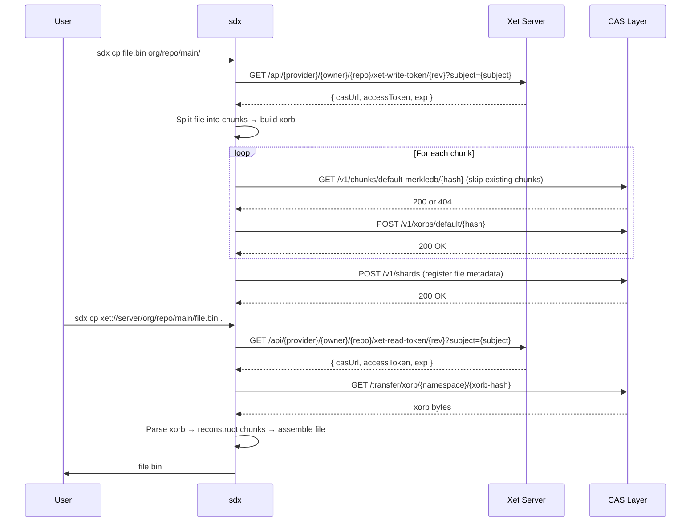

# Xet-Native File Management CLI

> **Status:** implemented.
> The `sdx` CLI described here ships with the `shardline` binary and provides native
> file transfer against any Xet-protocol server, including Shardline itself.

The shardline server implements the Xet CAS protocol for chunk-level deduplicated object
storage. The Hugging Face maintained `git-xet` (huggingface/xet-core) provides a Git LFS
custom transfer agent that works with any server supporting the Xet protocol, including
shardline. `sdx` is the standalone CLI for uploading and downloading files outside of a
Git workflow.

`sdx` is a file-transfer entrypoint that provides native file management against any
Xet-compatible server, including shardline itself.

## Scope

- `sdx cp` / `sdx sync` / `sdx ls` / `sdx rm` / `sdx cat` / `sdx info` / `sdx branch`
  provide a lightweight `cp`/`sync`/`ls`/`rm` interface for file transfer over the Xet
  CAS protocol.
- It targets any Xet-protocol server — not only shardline, but any server that
  implements the Xet read-token, write-token, and xorb-transfer endpoints.
- It reuses shardline's existing xorb chunking, CAS storage, and reconstruction logic as
  a client library rather than duplicating protocol work.
- It authenticates through the same provider-based token model: API key or bearer token
  to the server endpoint → scoped CAS token → content-addressed xorb transfer.
- It supports recursive directory upload, filtered download, incremental sync, and
  streaming large files.
- It ships as a single `shardline` binary — `sdx` is a symlink that invokes the same
  binary, which detects `argv[0]` and routes to the `xet` command lane automatically.

## Non-Goals

- Reimplementing the shardline server or any part of the CAS coordinator.
  The CLI is a client only.
- Replacing Git or Git LFS. The CLI targets direct file transfer, not version control
  workflows.
- Building a FUSE mount point.
  (The deprecated `pyxet` offered `xet mount`; this is a future consideration, not a
  current goal.)
- Supporting every Xet-protocol variant in the wild.
  The target is the endpoint and transfer surface that shardline itself implements.

## Dispatch Model

`sdx` is not a separate binary.
It is a symlink to `shardline`. The binary detects the invocation name at startup and
dispatches accordingly:

```mermaid
flowchart TD
  subgraph Canvas[ ]
    direction TD

    Binary[shardline binary]

    Binary --> Invocation{argv[0]}

    Invocation -->|shardline| Operator[Operator commands]
    Invocation -->|sdx| Xet[Xet file-transfer commands]

    subgraph Operator[ ]
        Serve[serve]
        Fsck[fsck]
        Gc[gc]
        Rebuild[index rebuild]
        Repair[repair]
        Backup[backup manifest]
        StorageMigrate[storage migrate]
        Hold[hold]
        Bench[bench]
        Admin[admin token]
        DbMigrate[db migrate]
        ConfigCheck[config check]
        Health[health]
        Completion[completion]
        Manpage[manpage]
    end

    subgraph Xet[ ]
        Cp[cp]
        Sync[sync]
        Ls[ls]
        Rm[rm]
        Cat[cat]
        Info[info]
        Branch[branch]
    end
  end

  style Canvas fill:#f8f4ec,stroke:#d7c9b2,color:#1f2937;
  classDef binary fill:#efe3f8,stroke:#b89bd6,color:#1f2937;
  classDef operator fill:#f6efe8,stroke:#c7b8a3,color:#1f2937;
  classDef xet fill:#dff3e4,stroke:#90c6a0,color:#1f2937;
  classDef dispatch fill:#fff3e0,stroke:#e0a050,color:#1f2937;
  class Binary binary;
  class Invocation dispatch;
  class Serve,Fsck,Gc,Rebuild,Repair,Backup,StorageMigrate,Hold,Bench,Admin,DbMigrate,ConfigCheck,Health,Completion,Manpage operator;
  class Cp,Sync,Ls,Rm,Cat,Info,Branch xet;
  linkStyle default stroke:#111827,stroke-width:1.5px;
```

Users who type `sdx cp` get a focused file-transfer surface with no server-operations
commands. Users who type `shardline serve` get the operator surface.
But both come from the same binary — one build, one version, one install.

Install-time setup:

```bash
# The binary ships as shardline. A symlink is created at install time.
ln -s shardline /usr/local/bin/sdx
```

For development:

```bash
cargo build
ln -s target/debug/shardline target/debug/sdx
./target/debug/sdx cp ./model.pt xet://...
```

The same lane is also reachable as the `xet` escape-hatch subcommand on the operator
binary (`shardline xet cp …`), which is how the manpage and shell completions expose it.

## Protocol Flow

The CLI interacts with a Xet-protocol server through a three-step sequence:



### Step 1 — Token Issuance

The CLI authenticates to the server and receives a time-bounded scoped CAS token.

Read token:

```bash
GET /api/{provider}/{owner}/{repo}/xet-read-token/{revision}?subject={subject}
Authorization: Bearer <server-token>
# or
X-Shardline-Provider-Key: <api-key>
```

Response:

```json
{
  "casUrl": "http://127.0.0.1:8080/",
  "exp": 1700000000,
  "accessToken": "<signed-cas-bearer-token>"
}
```

Write token uses the same pattern with `xet-write-token`. The token is scoped to the
specific repository, owner, and optional revision.
The `casUrl` field tells the CLI which base URL to use for the subsequent CAS transfer
operations. This separation supports deployments where the API control plane and the CAS
data plane run on different hosts or roles.

### Step 2 — CAS Transfer

The CLI uses the `accessToken` to authenticate against the CAS transfer endpoints at the
`casUrl` base.

Xorb download:

```
GET /transfer/xorb/{namespace}/{64-char-hex-hash}
Authorization: Bearer <accessToken>
```

Shardline validates the complete serialized xorb against the addressed hash before
exposing any requested range. This intentionally turns stale or corrupted provider
responses into an error rather than a successful partial body. The trade-off is that a
cold range request reads and validates the complete bounded xorb before responding.

Xorb upload:

```
HEAD /v1/xorbs/default/{hash}            # skip when the xorb already exists
POST /v1/xorbs/default/{hash}
Authorization: Bearer <accessToken>
Body: <xorb bytes>
```

Chunk-level deduplication checks use `GET /v1/chunks/default-merkledb/{hash}`;
a `404` means the chunk is not stored yet and is uploaded, while an existing chunk is
skipped.

The namespace is the server's repository-scoped prefix.
For shardline, the namespace is derived from the repository scope.

### Step 3 — Metadata Registration (Write Path)

After uploading xorb bytes, the CLI registers the file metadata with the server so the
file becomes discoverable through the server's reconstruction API.

```
POST /v1/shards
Authorization: Bearer <accessToken>
Body: { shard metadata }
```

Registration is the default for writes. `--no-register` performs a data-only CAS upload
that skips path-metadata registration; the file's chunks are still stored and fetchable
by their content hash.

## URL Scheme

The CLI uses a URI scheme that identifies the target server, repository, and path:

```
xet://<host>[:<port>]/<provider>/<owner>/<repo>/<revision>/<path>
```

Examples:

```bash
# Upload local file to remote
sdx cp ./model.pt xet://127.0.0.1:8080/generic/myorg/myrepo/main/model.pt

# Download remote file to local
sdx cp xet://127.0.0.1:8080/generic/myorg/myrepo/main/model.pt .

# Sync local directory into remote
sdx sync ./dataset/ xet://127.0.0.1:8080/generic/myorg/myrepo/main/

# List remote directory
sdx ls xet://127.0.0.1:8080/generic/myorg/myrepo/main/

# Print file to stdout
sdx cat xet://127.0.0.1:8080/generic/myorg/myrepo/main/model.pt

# Get file info
sdx info xet://127.0.0.1:8080/generic/myorg/myrepo/main/model.pt

# Remove file
sdx rm xet://127.0.0.1:8080/generic/myorg/myrepo/main/model.pt
```

The CLI also accepts a shorthand form when the server, auth, and default provider are
configured in the config file:

```bash
sdx cp ./model.pt myorg/myrepo/main/
```

## Authentication

The CLI authenticates to the server via one of the following, checked in order:

1. `--token` flag or `SHARDLINE_TOKEN` environment variable (bearer token)
2. `--api-key` flag or `SHARDLINE_API_KEY` environment variable (provider API key)
3. `--token-file` flag or `SHARDLINE_TOKEN_FILE` environment variable (path to file
   containing bearer token)
4. `--config` flag or `SHARDLINE_CONFIG` environment variable pointing to a
   configuration file, whose `[auth]` section supplies the credential

Credential priority is: CLI flags > environment variables > config `[auth]` section.

These are the client-side credential variables for the Xet file-transfer lane. They are
distinct from the operator-CLI signing-key variables (`SHARDLINE_TOKEN_SIGNING_KEY` /
`SHARDLINE_TOKEN_SIGNING_KEY_FILE`), which the server and `shardline admin token` use to
sign and mint tokens — a token minted by the operator CLI is what you pass to `sdx` as
`SHARDLINE_TOKEN` (or `--token`).

When a provider API key is supplied, the CLI issues a
`POST /v1/providers/{provider}/tokens` request to exchange it for a scoped CAS token.
When a bearer token is supplied, it is used directly as the `Authorization` header on
the token-issuance endpoints, and the server returns a short-lived CAS-scoped
`accessToken`.

The CLI caches the CAS access token and transparently refreshes it when it approaches
expiration (a 30-second refresh buffer), using the original credentials.
This keeps long-lived transfers (large files, deep sync) from failing mid-operation.
The `--subject` flag supplies the subject identifier the server requires on token
issuance.

## File Operations

### `cp`

Upload or download one or more files.
Supports recursive directory transfer.

```bash
# Upload file
sdx cp ./local.bin xet://host/provider/owner/repo/rev/remote.bin

# Upload directory recursively
sdx cp ./data/ xet://host/provider/owner/repo/rev/ --recursive

# Download file
sdx cp xet://host/provider/owner/repo/rev/remote.bin ./local.bin

# Download directory
sdx cp xet://host/provider/owner/repo/rev/data/ ./data/ --recursive
```

Remote-to-remote and local-to-local copies are rejected.

The CLI uses the same content-defined chunking and xorb format as the server.
This guarantees that files uploaded by the CLI are byte-identical to files uploaded
through the server's own ingest paths and can be reconstructed by any Xet-compatible
client.

### `sync`

Push-only directory synchronization modeled on `rsync` and `aws s3 sync`.

```bash
# Push local directory to remote, uploading only changed files
sdx sync ./data/ xet://host/provider/owner/repo/rev/data/
```

Pull sync is not supported: `sync` always uploads from a local source directory to a
`xet://` remote destination. Use `sdx cp --recursive` to download a directory.

The sync implementation compares file sizes (local) against remote metadata. It skips
files whose remote entry already matches the local size and uploads the rest. For each
file that needs transfer, it reuses the same `cp` xorb pipeline.

### `ls`

List files and directories at a remote path.

```bash
sdx ls xet://host/provider/owner/repo/rev/
sdx ls xet://host/provider/owner/repo/rev/data/ --long
sdx ls xet://host/provider/owner/repo/ --branches
```

Output mirrors familiar UNIX `ls` conventions.
The `--long` flag includes the file size alongside the path.
The `--branches` flag lists available revisions instead of directory contents.

### `rm`

Remove a file from a remote repository revision.

```bash
sdx rm xet://host/provider/owner/repo/rev/file.bin
sdx rm xet://host/provider/owner/repo/rev/data/ --recursive
```

`sdx rm` deregisters the path→file mapping from the revision's tree.
It does **not** delete the file record or its CAS objects: the content remains
reachable and reconstructable by its content hash, and storage is not reclaimed
(see `docs/reachability-model.md`).

### `cat`

Stream a remote file to stdout.
Useful for piping into other tools.

```bash
sdx cat xet://host/provider/owner/repo/rev/model.pt | python3 -c "..."
```

The cat implementation reconstructs the file and streams it without writing to disk.
For large files, it reconstructs chunk-by-chunk and writes each chunk to stdout as it
arrives.

### `info`

Display metadata about a remote file or repository revision.

```bash
sdx info xet://host/provider/owner/repo/rev/model.pt
sdx info xet://host/provider/owner/repo/rev/
```

For a file, output includes the path, file identifier, size, and last-updated time.
For a directory or repository root, it reports the file count and total byte size.

### `branch`

List, create, or delete revisions (branches).

```bash
sdx branch xet://host/provider/owner/repo/
sdx branch xet://host/provider/owner/repo/ --create new-feature
sdx branch xet://host/provider/owner/repo/ --delete old-feature
```

## Chunking and Deduplication

The CLI reuses the same chunking parameters and xorb format that the server uses.
The chunk-size boundary is configurable:

```bash
sdx cp ./large.bin xet://host/... --chunk-size 65536
```

The default chunk size matches the server default (64 KiB, gear-hash content-defined
chunking). The xorb format supports multiple compression modes:

- `none`: raw bytes, no compression
- `lz4`: LZ4 block compression (default)
- `bg4lz4`: bg4lz4 compression

```bash
sdx cp ./data.bin xet://host/... --compression lz4
```

When the CLI uploads a file, it:

1. Chunks the file with content-defined chunking (gear-hash CDC, target configurable,
   default 64 KiB) matching the server's ingest chunker.
2. Hashes each chunk with BLAKE3.
3. Checks each chunk hash against the CAS server (existing chunks are skipped).
4. Builds a xorb from the chunk hashes and their pack offsets.
5. Uploads the xorb to CAS.
6. Registers the file metadata with the server's index (unless `--no-register`).

On download, it:

1. Resolves the file through the server's reconstruction API or directly by xorb hash.
2. Downloads the xorb.
3. Iterates chunk references in the xorb.
4. Downloads missing chunks from CAS.
5. Assembles the file in order.

Existing chunks on the server are not re-uploaded, so uploading the same file twice is
idempotent and fast.
Uploading a file that shares chunks with an existing file deduplicates at the chunk
level automatically.

## Configuration

The CLI reads configuration from a file or environment variables:

```toml
# ~/.config/shardline/shardline.toml or SHARDLINE_CONFIG
[default]
endpoint = "http://127.0.0.1:8080"
provider = "generic"
owner = "myorg"
repo = "myrepo"
revision = "main"

[auth]
token = ""                # bearer token (or SHARDLINE_TOKEN)
api_key = ""              # provider API key (or SHARDLINE_API_KEY)
token_file = ""           # path to token file (or SHARDLINE_TOKEN_FILE)
```

CLI flags override environment variables, which override config file values.

## Packaging

There is one binary: `shardline`. The `sdx` name is a symlink created at install
time.

```bash
# Build
cargo build --workspace

# Install
cp target/release/shardline /usr/local/bin/shardline
ln -s shardline /usr/local/bin/sdx
```

The release archive ships one binary plus the symlink:

```bash
shardline-x.x.x-x86_64-unknown-linux-gnu/
├── shardline          # the only binary
├── sdx -> shardline
├── shardline.1        # manpage (covers both entrypoints)
└── shardline.bash     # shell completion
```

The install script creates the `sdx` symlink automatically.
Package managers (rpm, deb, Homebrew) should declare the symlink as a package symlink,
not a separate binary.

## History and Status

The `sdx` CLI was originally tracked as a design proposal in
[issue #19](https://github.com/STEXS-Technologies/shardline/issues/19). The proposal
staged the work in four phases — a read-only download CLI, a write/upload CLI,
directory operations, and discovery/management (`rm`, `branch`, config, packaging).
All four phases are now implemented: the `xet` command lane lives alongside the
operator commands in the `shardline` binary, backed by the `sdx` client library, and
ships with the manpage, shell completions, and the `sdx` symlink.

> **Internals note:** the `xet` lane lives in `crates/shardline/src/xet/`, backed by the
> `sdx` client library crate. It reuses the workspace protocol types (`RepositoryScope`,
> `TokenClaims`, `TokenSigner`, `ShardlineHash`, `ByteRange`, `SecretString`) and the
> xorb chunking/parsing code shared with the server. These crate and type names are
> implementation details; the user-facing contract is the `sdx` command surface
> described above.
