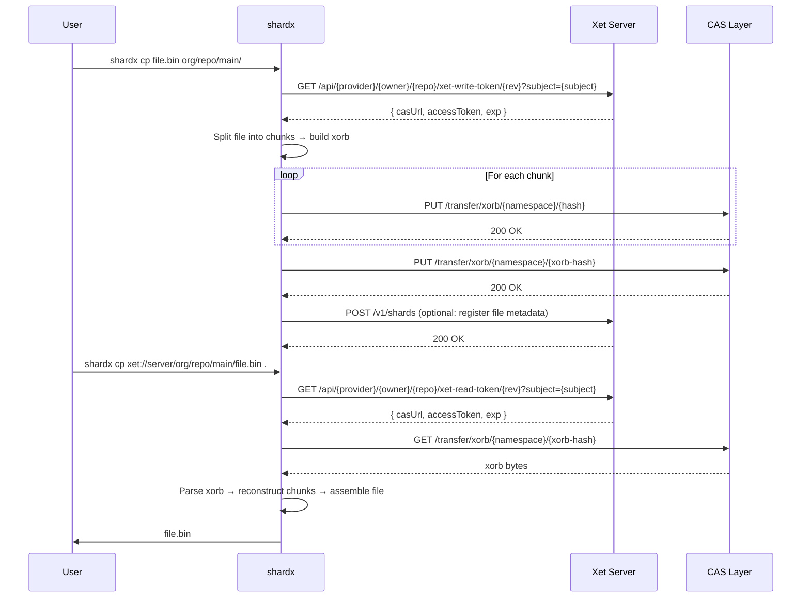

# Xet-Native File Management CLI

> **Status:** Design proposal. The `shardx` CLI described here is not yet implemented.
> See [issue #19](https://github.com/STEXS-Technologies/shardline/issues/19) for the
> current tracking issue.

The shardline server implements the Xet CAS protocol for chunk-level deduplicated object
storage. The Hugging Face maintained `git-xet` (huggingface/xet-core) provides a Git LFS
custom transfer agent that works with any server supporting the Xet protocol, including
shardline. However, there is no standalone CLI for uploading and downloading files
outside of a Git workflow.

This document describes a file-transfer entrypoint `shardx` that provides native file
management against any Xet-compatible server, including shardline itself.

## Goals

- Provide a lightweight `cp`/`sync`/`ls`/`rm` interface for file transfer over the Xet
  CAS protocol.
- Target any Xet-protocol server — not only shardline, but any server that implements
  the Xet read-token, write-token, and xorb-transfer endpoints.
- Reuse shardline's existing xorb chunking, CAS storage, and reconstruction logic from
  `shardline-xet-adapter` and `shardline-server-core` rather than duplicating protocol
  work.
- Authenticate via the same provider-based token model: API key or bearer token to
  server endpoint → scoped CAS token → content-addressed xorb transfer.
- Support recursive directory upload, filtered download, incremental sync, and streaming
  large files.
- Ship as a single `shardline` binary — `shardx` is a symlink that invokes the same
  binary, which detects `argv[0]` and routes to the `xet` subcommand automatically.

## Non-Goals

- Reimplementing the shardline server or any part of the CAS coordinator. The CLI is a
  client only.
- Replacing Git or Git LFS. The CLI targets direct file transfer, not version control
  workflows.
- Building a FUSE mount point in the initial scope. (The deprecated `pyxet` offered
  `xet mount`; this is a future consideration, not an initial goal.)
- Supporting every Xet-protocol variant in the wild. The initial target is the
  endpoint and transfer surface that shardline itself implements.

## Dispatch Model

`shardx` is not a separate binary. It is a symlink to `shardline`. The binary detects
the invocation name at startup and dispatches accordingly:

```mermaid
flowchart TD
  subgraph Canvas[ ]
    direction TD

    Binary[shardline binary]

    Binary --> Invocation{argv[0]}

    Invocation -->|shardline| Operator[Operator commands]
    Invocation -->|shardx| Xet[Xet file-transfer commands]

    subgraph Operator[ ]
        Serve[serve]
        Fsck[fsck]
        Gc[gc]
        Rebuild[index rebuild]
        Bench[bench]
        Admin[admin token]
        DbMigrate[db migrate]
        ConfigCheck[config check]
    end

    subgraph Xet[ ]
        Cp[cp]
        Sync[sync]
        Ls[ls]
        Rm[rm]
        Cat[cat]
        Info[info]
        Branch[branch]
    end
  end

  style Canvas fill:#f8f4ec,stroke:#d7c9b2,color:#1f2937;
  classDef binary fill:#efe3f8,stroke:#b89bd6,color:#1f2937;
  classDef operator fill:#f6efe8,stroke:#c7b8a3,color:#1f2937;
  classDef xet fill:#dff3e4,stroke:#90c6a0,color:#1f2937;
  classDef dispatch fill:#fff3e0,stroke:#e0a050,color:#1f2937;
  class Binary binary;
  class Invocation dispatch;
  class Serve,Fsck,Gc,Rebuild,Bench,Admin,DbMigrate,ConfigCheck operator;
  class Cp,Sync,Ls,Rm,Cat,Info,Branch xet;
  linkStyle default stroke:#111827,stroke-width:1.5px;
```

Users who type `shardx cp` get a focused file-transfer surface with no
server-operations commands. Users who type `shardline serve` get the operator surface.
But both come from the same binary — one build, one version, one install.

Install-time setup:

```bash
# The binary ships as shardline. A symlink is created at install time.
ln -s shardline /usr/local/bin/shardx
```

For development:

```bash
cargo build
ln -s target/debug/shardline target/debug/shardx
./target/debug/shardx cp ./model.pt xet://...
```

## Protocol Flow

The CLI interacts with a Xet-protocol server through a three-step sequence:



### Step 1 — Token Issuance

The CLI authenticates to the server and receives a time-bounded scoped CAS token.

Read token:

```bash
GET /api/{provider}/{owner}/{repo}/xet-read-token/{revision}?subject={subject}
Authorization: Bearer <server-token>
# or
X-Shardline-Provider-Key: <api-key>
```

Response:

```json
{
  "casUrl": "http://127.0.0.1:8080/",
  "exp": 1700000000,
  "accessToken": "<signed-cas-bearer-token>"
}
```

Write token uses the same pattern with `xet-write-token`. The token is scoped to the
specific repository, owner, and optional revision. The `casUrl` field tells the CLI
which base URL to use for the subsequent CAS transfer operations. This separation
supports deployments where the API control plane and the CAS data plane run on
different hosts or roles.

### Step 2 — CAS Transfer

The CLI uses the `accessToken` to authenticate against the CAS transfer endpoints at
the `casUrl` base.

Xorb download:

```
GET /transfer/xorb/{namespace}/{64-char-hex-hash}
Authorization: Bearer <accessToken>
```

Xorb upload:

```
PUT /transfer/xorb/{namespace}/{64-char-hex-hash}
Authorization: Bearer <accessToken>
Body: <xorb bytes>
```

The namespace is the server's repository-scoped prefix. For shardline, the namespace
is derived from the repository scope. The CLI extracts it from the token or from the
server's advertised namespace convention.

### Step 3 — Metadata Registration (Write Path)

After uploading xorb bytes, the CLI can optionally register the file metadata with the
server so the file becomes discoverable through the server's reconstruction API.

```
POST /v1/shards
Authorization: Bearer <accessToken>
Body: { shard metadata }
```

This step is optional for pure CAS upload but required for the file to be
reconstructable by other clients or by the server's index. The CLI should support both
modes:

- `--register` (default for write): register file metadata after upload
- `--no-register`: raw CAS upload without index registration

## URL Scheme

The CLI uses a URI scheme that identifies the target server, repository, and path:

```
xet://<host>[:<port>]/<provider>/<owner>/<repo>/<revision>/<path>
```

Examples:

```bash
# Upload local file to remote
shardx cp ./model.pt xet://127.0.0.1:8080/generic/myorg/myrepo/main/model.pt

# Download remote file to local
shardx cp xet://127.0.0.1:8080/generic/myorg/myrepo/main/model.pt .

# Sync local directory into remote
shardx sync ./dataset/ xet://127.0.0.1:8080/generic/myorg/myrepo/main/

# List remote directory
shardx ls xet://127.0.0.1:8080/generic/myorg/myrepo/main/

# Print file to stdout
shardx cat xet://127.0.0.1:8080/generic/myorg/myrepo/main/model.pt

# Get file info
shardx info xet://127.0.0.1:8080/generic/myorg/myrepo/main/model.pt

# Remove file
shardx rm xet://127.0.0.1:8080/generic/myorg/myrepo/main/model.pt
```

The CLI should also accept a shorthand form when the server, auth, and default
provider are configured:

```bash
shardx cp ./model.pt myorg/myrepo/main/
```

## Authentication

The CLI authenticates to the server via one of the following, checked in order:

1. `--token` flag or `SHARDLINE_TOKEN` environment variable (bearer token)
2. `--api-key` flag or `SHARDLINE_API_KEY` environment variable (provider API key)
3. `--token-file` flag or `SHARDLINE_TOKEN_FILE` environment variable (path to file
   containing bearer token)
4. `--config` flag or `SHARDLINE_CONFIG` environment variable pointing to a
   configuration file

These are the same environment variables the `shardline` binary uses. Since `shardx`
is the same binary invoked by symlink, it shares the configuration namespace. A user
who already has `SHARDLINE_TOKEN` set for the operator tooling gets the same auth for
file transfers without additional setup.

When a provider API key is supplied, the CLI issues a `POST /v1/providers/{provider}/tokens`
request to exchange it for a scoped CAS token. When a bearer token is supplied, it is
used directly as the `Authorization` header on the token-issuance endpoints, and the
server returns a short-lived CAS-scoped `accessToken`.

The CLI should cache the CAS access token and transparently refresh it when it expires,
using the original credentials. This keeps long-lived transfers (large files, deep sync)
from failing mid-operation.

## File Operations

### `cp`

Upload or download one or more files. Supports recursive directory transfer.

```bash
# Upload file
shardx cp ./local.bin xet://host/provider/owner/repo/rev/remote.bin

# Upload directory recursively
shardx cp ./data/ xet://host/provider/owner/repo/rev/ --recursive

# Download file
shardx cp xet://host/provider/owner/repo/rev/remote.bin ./local.bin

# Download directory
shardx cp xet://host/provider/owner/repo/rev/data/ ./data/ --recursive
```

The chunking and xorb construction uses the same `XorbWriter` from
`shardline-xet-adapter` that the server uses for ingest. Reconstruction uses
`XorbReader` and the same chunk-assembly logic. This guarantees that files uploaded
by the CLI are byte-identical to files uploaded through the server's own ingest paths
and can be reconstructed by any Xet-compatible client.

### `sync`

Push-only directory synchronization modeled on `rsync` and `aws s3 sync`.

```bash
# Push local directory to remote, uploading only changed files
shardx sync ./data/ xet://host/provider/owner/repo/rev/data/

# Pull remote directory to local
shardx sync xet://host/provider/owner/repo/rev/data/ ./data/
```

The sync implementation compares file sizes and modification times (local) against
remote metadata. It skips unchanged files and processes only the delta. For each file
that needs transfer, it reuses the same `cp` xorb pipeline.

### `ls`

List files and directories at a remote path.

```bash
shardx ls xet://host/provider/owner/repo/rev/
shardx ls xet://host/provider/owner/repo/rev/data/ --long
shardx ls xet://host/provider/owner/repo/ --branches
```

Output mirrors familiar UNIX `ls` conventions. The `--long` flag includes file size,
modification time, and content hash. The `--branches` flag lists available revisions.

### `rm`

Remove a file from a remote repository revision.

```bash
shardx rm xet://host/provider/owner/repo/rev/file.bin
shardx rm xet://host/provider/owner/repo/rev/data/ --recursive
```

Removal marks the file for garbage collection. The chunk bytes remain in CAS storage
until GC sweep confirms no remaining references.

### `cat`

Stream a remote file to stdout. Useful for piping into other tools.

```bash
shardx cat xet://host/provider/owner/repo/rev/model.pt | python3 -c "..."
```

The cat implementation reconstructs the file and streams it without writing to disk.
For large files, it reconstructs chunk-by-chunk and writes each chunk to stdout as it
arrives.

### `info`

Display metadata about a remote file or repository revision.

```bash
shardx info xet://host/provider/owner/repo/rev/model.pt
shardx info xet://host/provider/owner/repo/rev/
```

Output includes file size, content hash, chunk count, chunk-level deduplication
statistics, and modification time.

### `branch`

List, create, or delete revisions (branches).

```bash
shardx branch xet://host/provider/owner/repo/
shardx branch xet://host/provider/owner/repo/ --create new-feature
shardx branch xet://host/provider/owner/repo/ --delete old-feature
```

## Chunking and Deduplication

The CLI reuses the same chunking parameters and xorb format that the server uses. The
chunk-size boundary is configurable:

```bash
shardx cp ./large.bin xet://host/... --chunk-size 65536
```

Default chunk size matches the server default (`SHARDLINE_CHUNK_SIZE_BYTES`, typically
64 KiB). The xorb format supports multiple compression modes:

- `none`: raw bytes, no compression
- `lz4`: LZ4 block compression (default for most workloads)
- `bg4lz4`: bg4lz4 compression

```bash
shardx cp ./data.bin xet://host/... --compression lz4
```

When the CLI uploads a file, it:

1. Splits the file into fixed-size chunks (configurable, default 64 KiB).
2. Hashes each chunk with BLAKE3.
3. Checks each chunk hash against the CAS server (idempotent put — existing chunks
   are skipped).
4. Builds a xorb from the chunk hashes and their pack offsets.
5. Uploads the xorb to CAS.
6. Optionally registers the file metadata with the server's index.

On download, it:

1. Resolves the file through the server's reconstruction API or directly by xorb hash.
2. Downloads the xorb.
3. Iterates chunk references in the xorb.
4. Downloads missing chunks from CAS.
5. Assembles the file in order.

Existing chunks on the server are not re-uploaded, so uploading the same file twice
is idempotent and fast. Uploading a file that shares chunks with an existing file
deduplicates at the chunk level automatically.

## Crate Impact

The `xet` subcommand will live in `crates/shardline/src/command/xet.rs` alongside the existing
operator commands. No new crate is needed. The implementation draws on existing
workspace crates as libraries:

| Crate | Role |
| --- | --- |
| `shardline-protocol` | Token types (`RepositoryScope`, `TokenClaims`, `TokenSigner`), hash types (`ShardlineHash`), `ByteRange`, `SecretString` |
| `shardline-xet-adapter` | `XorbWriter` for chunking and xorb construction, `XorbReader` for xorb parsing and chunk extraction, `XorbStore` trait for CAS storage operations |
| `shardline-server-core` | Reconstruction planning, file validation limits |
| `shardline-storage` | `ObjectStore` trait — the CLI may talk to CAS via HTTP rather than embedding a store, but the trait defines the contract |

The CLI does not depend on `shardline-server`. It uses the protocol crate and the
adapter crate as client-side libraries. The server dependency is limited to the HTTP
API contract — `shardx` is a client, not an embedded server.

## Remote Operation

The CLI communicates with the server over HTTP(S). It does not require any server-side
changes beyond the existing Xet protocol endpoints that shardline already implements.

When the server supports it, the CLI should prefer presigned CAS URLs returned by the
token endpoint or reconstruction response. Presigned URLs allow direct object-store
access without proxying through the server's transfer layer, reducing latency for
large files.

The CLI falls back to the server-proxied transfer endpoint (`/transfer/xorb/...`)
when presigned URLs are not available — for example, when the server uses a local
filesystem adapter that cannot issue presigned URLs.

## Configuration

The CLI reads configuration from a file or environment variables:

```toml
# ~/.config/shardline/config.toml or SHARDLINE_CONFIG
[default]
endpoint = "http://127.0.0.1:8080"
provider = "generic"
owner = "myorg"
repo = "myrepo"
revision = "main"

[auth]
token = ""                # bearer token (or SHARDLINE_TOKEN)
api_key = ""              # provider API key (or SHARDLINE_API_KEY)
token_file = ""           # path to token file (or SHARDLINE_TOKEN_FILE)
```

CLI flags override config file values. Config file values override environment
variables.

## Packaging

There is one binary: `shardline`. The `shardx` name is a symlink created at install
time.

```bash
# Build
cargo build --workspace

# Install
cp target/release/shardline /usr/local/bin/shardline
ln -s shardline /usr/local/bin/shardx
```

The release archive ships one binary plus the symlink:

```bash
shardline-x.x.x-x86_64-unknown-linux-gnu/
├── shardline          # the only binary
├── shardx -> shardline
├── shardline.1        # manpage (covers both entrypoints)
└── shardline.bash     # shell completion
```

The install script creates the `shardx` symlink automatically. Package managers
(rpm, deb, Homebrew) should declare the symlink as a package symlink, not a
separate binary.

## Stub Implementation Path

A minimal working implementation follows these phases:

**Phase 1 — Read-only CLI (download)**
- Add `xet` subcommand to `crates/shardline/src/command/` with clap command tree.
- Implement token issuance (read token from server).
- Implement xorb download and chunk reconstruction.
- Implement `cat` (stream reconstructed file to stdout).
- Implement `cp <remote> <local>`.

**Phase 2 — Write CLI (upload)**
- Implement token issuance (write token from server).
- Implement file chunking and xorb construction via `XorbWriter`.
- Implement chunk-level idempotent CAS upload.
- Implement `cp <local> <remote>`.

**Phase 3 — Directory operations**
- Implement recursive upload and download.
- Implement `ls` and `info`.
- Implement `sync`.

**Phase 4 — Discovery and management**
- Implement `rm` (metadata deregistration).
- Implement `branch` (revision listing and management).
- Implement config file support and credential caching with transparent token refresh.
- Package completions, manpage, and release artifacts.

Phase 1 depends only on the server's existing read endpoints.
Phases 2–4 depend on the server's existing write and metadata endpoints.
No server-side changes are required for any phase.
